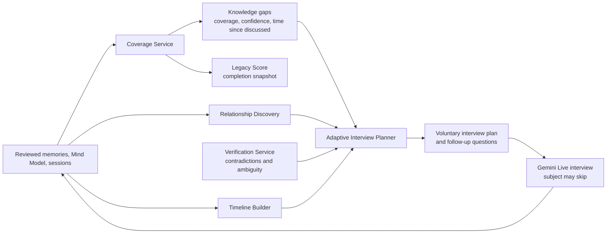

# ECHO Autonomous Life Interview Engine

## Purpose and limits

The Autonomous Life Interview Engine (ALIE) turns ECHO from isolated interview sessions into a voluntary, long-horizon Digital Legacy Builder. It knows which **domains have little supported coverage**, recommends the next best conversation, and adapts after each interview.

It does not claim a person has an unshared memory, relative, event, regret, or belief. A coverage gap means only: *ECHO has insufficient eligible evidence in this domain.* The subject can skip, defer, suppress, or disable any domain at any time. Recommendations are invitations, never requirements.

## System architecture



ALIE consumes the existing Memory Engine, Mind Model, and Cognitive Engine. It does not bypass memory consent, change source evidence, or create family-visible claims directly.

## Knowledge Coverage Engine

`coverage_service.py` creates profile-scoped `knowledge_domains` from the standard taxonomy:

```text
family, childhood, career, education, relationships, dreams, failures,
successes, regrets, beliefs, values, humor, health, travel, friends,
marriage, parenthood, advice, life_lessons, future_hopes, legacy
```

Each domain is configurable and may be disabled or marked do-not-prompt by the subject. For each enabled domain, `coverage_scores` stores:

- `coverage_score` (0-100): breadth and depth of eligible, reviewed evidence;
- `confidence_score`: confidence that the score represents the available evidence, not a claim of factual completeness;
- `missing_topics`: neutral coverage descriptors such as "college years have little detail";
- `last_interview_at` and evidence/conversation counts;
- `priority_score`: planner input, not an instruction to pressure the subject.

Recommended scoring inputs:

```text
coverage = weighted breadth of subtopics
         + independent-conversation depth
         + timeline specificity
         + reviewed-memory quality

priority = gap impact + confidence deficit + time since discussion
         + subject selected interests - emotional sensitivity - recent repetition
```

The formula is versioned. A domain with zero data is labelled "not yet explored," never "missing." Health, grief, regret, trauma-adjacent, and other sensitive topics default to `gentle_only` or disabled until the subject opts in.

## Adaptive Interview Planner

`interview_planner.py` produces a small ordered `interview_plan` from eligible `knowledge_gaps`, active `verification_tasks`, relationship/timeline opportunities, and current session state.

Planner constraints, in order:

1. Confirm Mind Model/interview consent and domain enablement.
2. Respect `do_not_nudge_before`, dismissed plans, skipped questions, and domain suppression.
3. Reject a question whose semantic fingerprint is too similar to a recently asked/answered question unless it is an explicit verification follow-up.
4. Prefer a subject-selected domain or a low-pressure continuation of a recent story.
5. Reduce priority after a skipped question; do not rephrase-and-repeat it in the same session.
6. Defer high-sensitivity topics when readiness is unknown or `defer`.
7. Offer at most the configured number of recommendations; the subject can start a free conversation instead.

Example recommendations are framed as optional:

- "Career stories are lightly explored. Would you like to talk about your first job?"
- "College has not come up much yet. You can skip this, or share one memory if you want."
- "You have mentioned your grandfather several times. Would you like to tell me who he was to you?"

The third example creates a `mentioned_person` opportunity; it does not assert a family relationship or require a response.

## Conversation Strategy Engine

The planner assigns each proposed question one strategy in `follow_up_questions`:

| Strategy | Purpose | Safe example |
|---|---|---|
| `follow_up` | Continue a volunteered story | "What happened after that?" |
| `reflection` | Invite meaning, not diagnosis | "What stayed with you from that time?" |
| `clarification` | Resolve ambiguous details | "Do you remember roughly when that was?" |
| `deeper_why` | Explore a stated choice | "What made that choice feel right then?" |
| `memory_verification` | Address conflicting recollections | "You described this two ways. Is there more context you would like to add?" |
| `relationship_discovery` | Ask how a named person mattered | "What was your relationship with them like?" |
| `timeline_clarification` | Improve date range only when desired | "Was that before or after you moved?" |

Gemini Live receives only the active plan and the subject's skip/defer controls. It may leave the plan when the subject brings up something more important. The planner records question status, not an emotional judgement about the answer.

## Memory verification

`verification_service.py` creates a `verification_task` when reviewed, consent-eligible evidence conflicts on a date, identity, relationship, memory detail, or Mind Model trait.

1. Preserve all original memories and their confidence.
2. Create a neutral task with source ids and a clarification prompt.
3. Wait for a suitable voluntary interview; do not interrupt or interrogate the subject.
4. Add any new answer as additional evidence.
5. Recompute confidence and timeline/trait status; never overwrite old evidence.

If the subject declines, defer or dismiss the task. The Cognitive Engine then represents the ambiguity instead of choosing a convenient version.

## Relationship discovery

`relationship_discovery.py` extracts candidate named people from reviewed memories and creates `relationship_entities` with confidence and relationship strength only when evidence supports it. `relationship_evidence` links each candidate to source memory/session excerpts and shared-memory summaries.

Rules:

- A repeated name is a candidate person, not proof of identity or kinship.
- Name matching is conservative; uncertain duplicates remain separate until a subject confirms or evidence supports a merge.
- Relationship type and strength remain unknown when the evidence is insufficient.
- The subject can edit, merge, hide, or revoke relationship entities.

The existing family access graph remains the authorisation source. The discovered relationship graph is a private memory-organising graph, not access control.

## Life Timeline Builder

`timeline_builder.py` augments the existing `life_timeline_events` and `personality_timeline` data:

- detects candidate jobs, schools, moves, marriages, children, awards, losses, and other events from reviewed memories;
- records exact dates only when stated or verified;
- stores broad intervals or unknown dates as uncertain rather than manufacturing precision;
- links events to source memory ids; and
- creates clarification opportunities only when useful and eligible.

Timeline events can be used by the Cognitive Engine's temporal retrieval but never override source memories.

## Legacy Completeness Score

`legacy_score.py` writes a time-series `legacy_scores` snapshot, displayed as **Digital Mind Completion**. It measures collected, consent-eligible coverage, not the worth or completeness of a person.

```text
overall = weighted mean(
  memory_completeness,
  reasoning_completeness,
  value_completeness,
  voice_completeness,
  timeline_completeness,
  relationship_completeness
)
```

Each component is 0-100 and has a confidence score. The dashboard should display both, for example: "Life timeline: 42% explored (medium confidence)." Scores should never be used to shame, rank, or pressure a subject. A subject may hide the score entirely.

## Backend services

```text
apps/api/app/services/
  coverage_service.py        # Domain bootstrap, score calculation, gap lifecycle
  interview_planner.py       # Voluntary plan/question selection and repetition guard
  relationship_discovery.py  # Candidate people and evidence-backed relationship graph
  timeline_builder.py        # Uncertain/event-based life timeline extraction
  verification_service.py    # Conflict task lifecycle; preserves all evidence
  legacy_score.py            # Digital Mind Completion snapshots
```

Processing sequence after reviewed memory creation:

```text
memory.extracted
  -> relationship discovery + timeline builder
  -> coverage recalculation
  -> verification scan
  -> legacy score snapshot
  -> generate/re-rank interview recommendations
```

Processing must be idempotent by source memory/version. A memory consent change, deletion, domain suppression, or subject skip triggers score/recommendation recomputation. Recommendations are never sent through email/push unless the subject separately opted in.

## Database design

Migration [`014_autonomous_life_interview_engine.sql`](../apps/api/app/db/migrations/014_autonomous_life_interview_engine.sql) adds:

| Table | Role |
|---|---|
| `knowledge_domains` | Per-Mind-Profile enabled domain taxonomy |
| `coverage_scores` | Coverage, confidence, priority, last interview, missing-topic descriptors |
| `knowledge_gaps` | Neutral coverage/contradiction opportunities with suppression and sensitivity state |
| `interview_plans` | Voluntary scheduled/recommended sessions |
| `follow_up_questions` | Strategy-tagged questions and skip/answer lifecycle |
| `verification_tasks` | Non-destructive conflict and clarification workflow |
| `relationship_entities` | Candidate important people with confidence/strength |
| `relationship_evidence` | Attributable shared-memory links |
| `legacy_scores` | Versioned Digital Mind Completion history |

All tables have `user_id`, `created_at`, `updated_at`, RLS, ownership triggers, indexes, and foreign keys to the Mind Model/source evidence. Family clients cannot read planning records directly.

## API design

All APIs require a Supabase JWT. The subject owns planning and coverage endpoints; family members cannot schedule, inspect, or override an interview plan.

| Endpoint | Purpose |
|---|---|
| `GET /life-journey/coverage` | Coverage heatmap, confidence, priorities, and subject-visible gaps |
| `GET /life-journey/recommendations` | Voluntary next-session recommendations and reasons |
| `POST /life-journey/interview-plans/{id}/accept` | Accept a recommendation and start a session |
| `POST /life-journey/follow-ups/{id}/skip` | Skip/defer a question; planner reduces future repetition |
| `GET /life-journey/timeline` | Date-bounded timeline with uncertainty labels and citations |
| `GET /life-journey/relationships` | Private relationship graph with evidence counts |
| `GET /life-journey/completion` | Latest and historical Digital Mind Completion snapshot |
| `PATCH /life-journey/domains/{id}` | Enable/disable/suppress a domain or alter prompting preference |

The session API also accepts an optional `interview_plan_id`; it records the plan outcome without preventing an unplanned interview.

## Frontend: Life Journey dashboard

The subject-facing dashboard contains:

- **Digital Mind Completion:** a clear progress card with component scores, confidence, and a hide option.
- **Coverage heatmap:** all enabled domains, coverage bands, last discussed date, and "not yet explored" state.
- **Timeline explorer:** event cards with broad/uncertain date labels and source-memory links.
- **Relationship graph:** evidence-counted people nodes, uncertain labels, and edit/merge/revoke controls.
- **Mind growth chart:** score trends and newly supported values/reasoning patterns; not a behavioural grade.
- **Interview recommendations:** one or a few optional cards with Start, Skip, and Later actions.
- **Safety controls:** per-domain disable, prompt-frequency settings, a global pause, and an explanation of why an item was recommended.

Recommendations must not use alarmist language, streaks, countdowns, guilt, or engagement metrics. The default visual state is calm and informational.

## Deployment and rollout

No additional AI provider is required. Configure policy rather than hardcode it:

```text
AUTONOMOUS_INTERVIEWS_ENABLED=false
INTERVIEW_PLANNER_VERSION=2026-01
MAX_RECOMMENDATIONS_PER_WEEK=1
MIN_DAYS_BETWEEN_DOMAIN_PROMPTS=30
LIFE_JOURNEY_NOTIFICATIONS_ENABLED=false
```

Rollout:

1. Apply migrations `012`, `013`, and `014`; test owner/cross-user RLS and consent revocation.
2. Bootstrap domains and calculate coverage in shadow mode without showing recommendations.
3. Enable subject-only dashboard and manual "Explore this topic" actions.
4. Enable one optional recommendation at a time; evaluate skip rate, repetition rate, and emotional-boundary complaints.
5. Enable optional reminders only after explicit notification consent and suppression tests.

## Acceptance criteria

- Every recommendation identifies a neutral reason, a domain, and a skip/defer action.
- A skipped/suppressed question is not repeated in the configured window.
- Conflicting memories remain available and attributable; no evidence is overwritten.
- Unknown dates and relationships remain uncertain in UI and APIs.
- Completion reflects evidence coverage and confidence, not a claim about the person.
- No family member can inspect or alter the subject's interview plans, gaps, or score without explicit future consent design.

ALIE gives ECHO a respectful memory of its own learning process: it can discover what remains unexplored while leaving the subject in control of whether, when, and how to share it.
