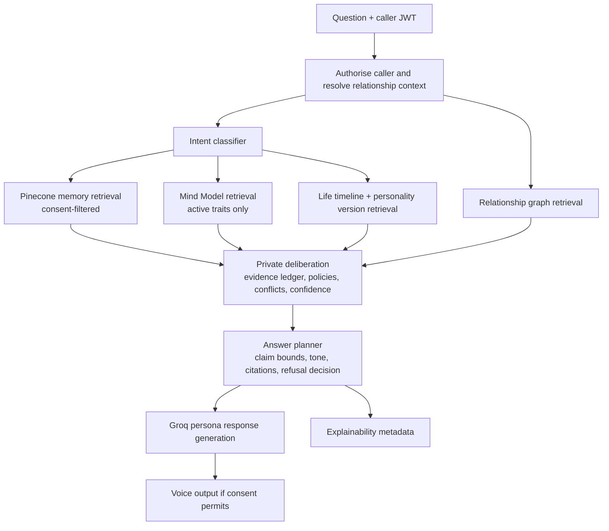

# ECHO Cognitive Reasoning Engine

## Purpose

The Cognitive Engine is the response-time reasoning layer above ECHO's Memory Graph, Mind Model, Persona Model, RAG, Voice Model, Consent Architecture, and Confidence Engine. It does not make ECHO more speculative. It makes the order of operations explicit:

```text
Question -> intent -> authorised evidence -> relationship and time context
-> bounded internal deliberation -> answer plan -> grounded response -> voice
```

The engine uses the subject's supported decision policies, values, beliefs, emotional patterns, relationship context, and dated evidence to plan an answer. It never exposes hidden chain-of-thought and never stores it. The only persisted artifact is a bounded, auditable **answer plan**: selected sources, applicable policy, confidence, conflicts, and the response outcome.

## System pipeline



### Non-negotiable boundary

The deliberate step is an internal, bounded data structure. It can contain source ids, relevance scores, policy ids, conflict state, time scope, and a response outline. It must **not** capture, return, or log private free-form chain-of-thought.

## Intent classifier

`intent_service.py` produces structured, versioned intent data rather than a free-form prompt label.

| Intent | Required evidence and planning mode | Example question |
|---|---|---|
| `memory_recall` | high-similarity memories; exactness preferred | "What was her first job?" |
| `storytelling` | ordered memories and timeline events | "Tell me about moving to Delhi." |
| `advice` | life principles, values, decision policies, source memories | "What would Dad advise about marriage?" |
| `opinion` | supported belief plus time scope | "What did she think about education?" |
| `emotional_support` | relationship tone, emotional patterns, relevant memories | "What would he say while I am grieving?" |
| `explanation` | reasoning pattern and fact sources | "Why did she choose that career?" |
| `decision_making` | decision policy, trade-offs, conflicts, timeline | "Would he take this risky job?" |
| `life_lesson` | recurring life principles with independent evidence | "What lesson did she repeat most?" |
| `unknown` | clarify or use uncertainty response | unsupported or ambiguous request |

The classifier returns `primary_intent`, optional secondary intents, requested relationship/time cues, and a classifier confidence. Low classifier confidence selects a conservative mixed retrieval plan or asks one clarification question; it never invents an intent.

## Internal deliberation and answer planning

`cognitive_engine.py` orchestrates a private `DeliberationEnvelope` with only bounded fields:

```json
{
  "intent": "decision_making",
  "relationship_context_id": "...",
  "timeline_scope": {"as_of": "1998-01-01", "version_id": "..."},
  "evidence_ids": ["memory:...", "core_value:...", "decision_policy:..."],
  "conflicts": [{"topic": "risk", "source_ids": ["..."]}],
  "confidence": 0.78,
  "outcome": "answered"
}
```

`answer_planner.py` converts that envelope into an `AnswerPlan`:

- permitted factual claims and the memory ids supporting them;
- relevant values, beliefs, life principles, and decision policy ids;
- relationship-aware tone and disclosure constraints;
- applicable time period/version;
- conflict framing or refusal instruction;
- citations and developer-safe explainability metadata.

The generator sees only the AnswerPlan and cited source excerpts. This separates retrieval/planning from language generation and prevents the generation model from using broad, unsupported personality claims.

## Decision simulator

`reasoning_service.py` selects active `decision_policies` and `decision_patterns`. A policy is reusable only after it meets the same evidence and confidence rules as other Mind Model traits.

Supported policy kinds are `risk_first`, `family_first`, `faith_first`, `logic_first`, `optimistic`, `cautious`, `traditional`, `pragmatic`, and `custom`.

Each policy contains a priority order, applicable situations, evidence count, first/last observation, and confidence. The simulator does not compute a fictional conclusion. It ranks the choices and trade-offs that the sources show the subject considering. If there is no policy with sufficient evidence, planning returns `uncertain`.

## Relationship awareness

`relationship_service.py` resolves the caller into a `relationship_contexts` record. A context may be linked to an approved `legacy_contacts` grant or represent a subject-configured default such as `public`.

Relationship changes **wording, emotional framing, and disclosure**, not factual truth:

- A grandchild may receive a warmer, age-appropriate explanation.
- A spouse may receive an intimate but consent-filtered framing.
- A doctor may receive concise factual language and no invented medical opinion.
- A public caller receives only public/family-permitted sources and neutral wording.

The caller cannot choose a more privileged relationship label. The backend derives it from the authenticated contact grant and subject-approved context.

## Temporal reasoning

`timeline_service.py` resolves `as_of` dates and periods using `life_timeline_events` and `personality_timeline` snapshots.

1. If the caller asks "when she was 30," retrieve the nearest supported timeline window.
2. Prefer traits and policies active in that window.
3. If dated sources conflict, produce a time-bounded answer: "Earlier interviews support X; later interviews support Y."
4. If a requested time has no evidence, return the standard uncertainty response.

The engine never combines an early-life belief and late-life belief into a false timeless personality trait.

## Multi-source confidence and conflict resolution

`confidence_service.py` computes answer confidence from independent, eligible sources:

```text
answer_confidence = min(
  intent_confidence,
  evidence_coverage,
  timeline_fit,
  relationship_authorisation,
  applicable_trait_confidence
) - conflict_penalty
```

`conflict_resolver` is a pure policy component inside `cognitive_engine.py`:

- **No conflict:** generate within the AnswerPlan bounds.
- **Temporal conflict:** explain both time-scoped viewpoints.
- **Same-time conflict:** describe the ambiguity; do not choose a side.
- **Consent conflict:** remove ineligible evidence and recompute.
- **Insufficient evidence:** return exactly: **"I don't know enough about how they would think about this."**

Response generation is blocked whenever the post-filter confidence is lower than `mind_profiles.min_response_confidence`.

## Backend modules

```text
apps/api/app/services/
  intent_service.py          # Intent schema/classification and conservative fallback
  cognitive_engine.py        # Orchestration, bounded deliberation, conflict policy
  relationship_service.py    # Contact grant -> relationship context and disclosure limits
  timeline_service.py        # as_of/date window and versioned trait retrieval
  reasoning_service.py       # Decision policy/pattern selection and trade-off ranking
  answer_planner.py          # Evidence-bound answer plan and generator context
  confidence_service.py      # Deterministic scoring and uncertainty gate
```

Supporting worker additions:

```text
workers/
  derive_decision_policies.py       # Promotes supported reusable policies
  build_life_timeline.py            # Extracts dated events from reviewed memories
  recompute_cognitive_confidence.py # Re-evaluates after evidence/consent changes
```

All modules receive an authenticated `user_id`, `mind_profile_id`, and permitted consent levels. No module may call Pinecone or PostgreSQL without those scopes.

## Database design

Migration [`013_cognitive_engine.sql`](../apps/api/app/db/migrations/013_cognitive_engine.sql) adds:

| Table | Purpose |
|---|---|
| `decision_policies` | Reusable, evidence-backed policies such as family-first or cautious |
| `relationship_contexts` | Subject-owned relationship framing and disclosure policy, optionally tied to an approved legacy contact |
| `life_timeline_events` | Dated, attributable life events used for temporal retrieval |
| `cognitive_runs` | Auditable intent/outcome/confidence/answer-plan record; no raw reasoning trace |
| `cognitive_evidence` | Consent-filtered evidence ledger for one cognitive run |

Every table includes `user_id`, `created_at`, and `updated_at`; it has indexes, ownership triggers, and RLS. `cognitive_runs.answer_plan` is constrained to JSON object data and is explicitly limited to response bounds/citations. It must never contain provider chain-of-thought, hidden reasoning, or raw prompt logs.

## API contract

All endpoints validate Supabase JWTs. Subject-facing endpoints require ownership. `POST /cognitive/reason` may be called by an approved family contact only after relationship and consent checks.

| Endpoint | Contract |
|---|---|
| `POST /cognitive/reason` | `{question, as_of?, relationship_context_hint?}` -> response text plus explainability metadata |
| `POST /cognitive/explain` | `{cognitive_run_id}` -> safe evidence ledger and policy/timeline/confidence summary; never deliberation text |
| `GET /mind/timeline?as_of=&entity_type=` | Subject-owned time-bounded trait/event view |
| `GET /mind/values` | Active/candidate values with confidence and evidence counts; candidate detail subject-only |

Example response:

```json
{
  "answer": "...",
  "outcome": "answered",
  "confidence": 0.81,
  "explanation": {
    "intent": "advice",
    "memory_ids": ["..."],
    "mind_trait_ids": ["..."],
    "value_ids": ["..."],
    "decision_policy_id": "...",
    "relationship_context": "grandchild",
    "timeline_version_id": "...",
    "conflict_summary": null
  }
}
```

## Cognitive Debug View

The developer-only frontend view is a post-plan inspection tool, not a reasoning viewer. It displays:

- classified intent and classifier confidence;
- retrieved, consent-eligible memory ids/excerpts;
- active values, beliefs, decision policies, and confidence bands;
- resolved relationship context and disclosure level;
- selected timeline window/version;
- conflict state, final confidence, outcome, and citation ids.

It must never display provider hidden reasoning, token traces, or private sources in a less-authorised user session. Gate it behind a server-side developer role/feature flag and redact data using the same response-time consent filter as the real answer.

## Deployment plan

No new model provider is required. Add configuration values rather than hardcoding policy:

```text
COGNITIVE_ENGINE_ENABLED=false
COGNITIVE_ENGINE_POLICY_VERSION=2026-01
COGNITIVE_MIN_INTENT_CONFIDENCE=0.70
COGNITIVE_MIN_ANSWER_CONFIDENCE=0.70
COGNITIVE_DEBUG_VIEW_ENABLED=false
```

Deployment stages:

1. Apply migrations `012_mind_model.sql` and `013_cognitive_engine.sql`; verify RLS with owner/cross-user tests.
2. Run timeline and decision-policy extraction in shadow mode; persist candidates only.
3. Enable Cognitive Debug View for developers and measure citation precision, false-confidence rate, and refusal correctness.
4. Enable subject-only cognitive responses behind a feature flag.
5. Enable family traffic after relationship-context redaction, timeline conflict, revocation propagation, and load tests pass.

## Acceptance criteria

- Every cognitive response has an intent, outcome, confidence, citations, relationship context, and timeline version/null.
- A response below threshold returns the required uncertainty sentence verbatim.
- No response source bypasses memory consent or relationship authorisation.
- A revoked memory or trait is removed from future cognitive evidence ledgers within the defined propagation SLO.
- Debug data contains no raw chain-of-thought.

This turns ECHO into a bounded Digital Mind: it retrieves what was lived, plans according to supported cognitive patterns, and explains why it can answer without pretending to know more than the evidence allows.
