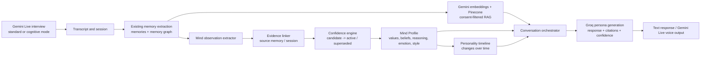
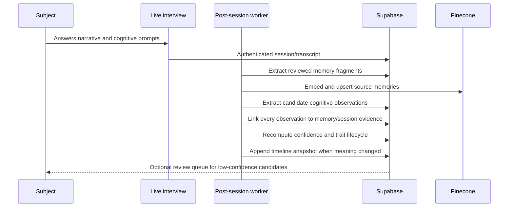
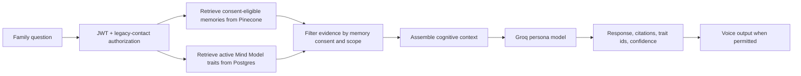

# ECHO Mind Model Architecture

## Purpose and boundary

The Mind Model is a consent-gated cognitive layer added **on top of** ECHO's memory graph, Pinecone retrieval, persona generation, voice fingerprinting, and family conversation systems. It is not a general personality predictor and it never replaces a source memory.

Its job is to preserve supported patterns in how a subject explains choices, expresses values, responds emotionally, communicates, and gives advice. Each pattern remains traceable to the memories and interviews that support it. A model with insufficient evidence must say: **"I don't know enough about how they would think about this."**

## System architecture



The graph intentionally has two stores:

- **Memory/RAG store:** Pinecone keeps semantic representations of source memories for fast retrieval.
- **Mind store:** Supabase PostgreSQL keeps structured, auditable, revisionable claims and their evidence. Mind traits are not embedded as a replacement for factual memory retrieval.

## Cognitive domains

| Domain | Stored evidence-backed model | Example supported output |
|---|---|---|
| Core identity | beliefs, core values, worldview, motivations | "She repeatedly described keeping family close as a priority." |
| Reasoning engine | decision and reasoning patterns, trade-offs, moral framing | "When choosing jobs, he weighed stability above prestige in several interviews." |
| Emotional model | triggers, emotional response, resilience, recovery | "She described taking time alone after conflict before returning to talk." |
| Communication style | vocabulary, rhythm, stories, favorite phrases, humor | "Uses short, practical stories before giving advice." |
| Relationship model | relationship-labelled patterns derived from source context | "In parenting stories, he emphasized listening before correcting." |
| Wisdom engine | recurring advice promoted to life principles | "Family comes first" becomes an active principle only after repeated, attributable support. |
| Personality evolution | dated trait snapshots, not overwritten traits | "Risk tolerance appears lower in retirement-era interviews than early-career interviews." |

The relationship model uses `reasoning_patterns`, `decision_patterns`, `emotional_patterns`, and `life_principles` with relationship context in their structured JSON fields. This prevents a misleading separate universal label such as "good parent" without scoped evidence.

## Data model

Migration [`012_mind_model.sql`](../apps/api/app/db/migrations/012_mind_model.sql) is the source of truth. It adds the requested tables:

| Table | Responsibility | Key relationships |
|---|---|---|
| `mind_profiles` | Consent-gated root, response threshold, lifecycle state | one profile per `user_id`, optionally linked to that user's subject |
| `beliefs` | A specific proposition and stance | belongs to `mind_profiles` |
| `core_values` | Named value plus priority | belongs to `mind_profiles` |
| `reasoning_patterns` | Problem solving, trade-offs, moral framing | belongs to `mind_profiles` |
| `decision_patterns` | Situational choices and risk posture | belongs to `mind_profiles` |
| `emotional_patterns` | Triggers, response and recovery | belongs to `mind_profiles` |
| `communication_patterns` | Vocabulary, rhythm, storytelling, complexity, phrases | belongs to `mind_profiles` |
| `humor_patterns` | Style, boundaries and examples | belongs to `mind_profiles` |
| `life_principles` | Recurring advice promoted to wisdom | belongs to `mind_profiles` |
| `mind_evidence` | Immutable claim-to-memory/session attribution | points to `memories` and/or `sessions` |
| `personality_timeline` | Dated trait snapshots and change summaries | identifies a trait by type + id |
| `confidence_metrics` | Versioned confidence calculation and evidence counts | one record per trait/version target |

All Mind Model tables carry `user_id`, `created_at`, and `updated_at`. RLS restricts direct table access to the owning subject. Family clients do **not** query these tables directly; the backend validates a legacy-contact grant, the subject's active Mind Model consent, and every source-memory consent level before creating a filtered response context.

### Trait lifecycle

1. **Candidate:** an extractor finds a possible pattern from an interview or reviewed memory. It cannot influence responses.
2. **Active:** the confidence engine has enough independent, consent-eligible evidence and no contradictory superseding evidence.
3. **Superseded:** a newer, better supported timeline observation replaces its current interpretation; old evidence is retained.
4. **Revoked:** subject consent is withdrawn or a subject removes the trait. It cannot be retrieved or generated from.

No worker may promote a trait solely because an LLM generated a plausible statement. Promotion requires source evidence and deterministic confidence policy.

## Continuous learning pipeline



### Worker responsibilities

`process_session` remains responsible for the existing transcript, memory extraction, embedding, and persona-data flow. It publishes `memory.extracted` events after reviewed fragments are stored. New workers consume those events:

- `extract_mind_observations`: asks the configured Groq structured-output model for **candidate** claims only. JSON schema requires domain, claim, supporting excerpt, source memory id, temporal context, and a model-estimated confidence.
- `link_mind_evidence`: rejects claims that cannot be linked to a consent-eligible memory/session or whose excerpt is not entailed by the source.
- `recompute_mind_confidence`: applies deterministic scoring, promotion thresholds, contradiction detection, and active/superseded transitions.
- `build_personality_timeline`: writes a snapshot when an active trait changes materially across dated evidence.
- `refresh_mind_summary`: creates a compact summary from active traits only; it never becomes the sole evidence source.

Each worker is idempotent using `(mind_profile_id, source_memory_id, extraction_version)` as its logical dedupe key. Jobs must record model, prompt, extraction version, latency, and failure reason in `processing_jobs`/observability, but must not log raw private transcript contents outside the approved data boundary.

## Confidence engine

The confidence score is a deterministic, explainable calculation, not the LLM's self-assessment:

```text
score = clamp(
  0.35 * independent_source_coverage +
  0.25 * evidence_specificity +
  0.20 * temporal_consistency +
  0.15 * subject_confirmation +
  0.05 * recency,
  0, 1
) - contradiction_penalty
```

Recommended policy defaults:

- Fewer than two independent conversations: remain `candidate`.
- `score < 0.70`: do not use for subject-reasoning claims; disclose uncertainty if it is relevant.
- `0.70 <= score < 0.85`: may use qualified phrasing, such as "In the stories shared, they often...".
- `score >= 0.85`: may influence a response only with at least one retrieved, consent-eligible source citation.
- Contradictory evidence creates a timeline change or ambiguity; it must not be averaged into a false permanent trait.

`confidence_metrics` stores score, number of supporting conversations, first observed, last updated, and the calculation version. The response API returns this data for every trait it uses.

## Cognitive interview mode

The existing life-story mode remains available. A second `cognitive_discovery` mode changes the interviewer strategy, not the underlying audio stack.

1. Begin with a lived event: "What happened?"
2. Ask one evidence-seeking follow-up: "Why did you choose that?"
3. Explore alternatives: "What would you do differently now?"
4. Elicit value and trade-off: "What mattered most? What did you give up?"
5. Capture advice: "What would you tell someone you love in that situation?"
6. Ask for a counterexample when appropriate: "Was there ever a time you felt differently?"
7. Close with consent-aware reflection, never a diagnosis or categorical personality label.

The Gemini Live system instruction must avoid leading questions (for example, "You value family most, right?") and must not present inferred traits as facts. The session is tagged with `interview_mode`, temporal context, and question family so the extractor can weight evidence appropriately.

## Conversation and retrieval pipeline



The new response contract contains:

```json
{
  "answer": "...",
  "confidence": 0.82,
  "memory_sources": [{"memory_id": "...", "excerpt": "..."}],
  "mind_sources": [{"entity_type": "core_value", "entity_id": "...", "confidence": 0.88}],
  "reasoning_sources": [{"entity_id": "...", "confidence": 0.79}],
  "limitations": []
}
```

If no adequate memory or Mind Model evidence is eligible, `answer` is the explicit uncertainty response and `limitations` explains that ECHO lacks enough evidence. The orchestrator must never silently substitute generic model knowledge for a subject opinion.

## Cognitive context prompt

The following is an input contract for the Groq persona service. It is assembled server-side after authorisation and source filtering.

```text
You are ECHO, a grounded representation of {subject_name}, not an omniscient simulation.

Rules:
1. Use only the cited source memories and active mind traits below.
2. Do not state a belief, value, preference, or decision style as fact unless its confidence meets the response policy.
3. Do not invent facts, opinions, relationships, or advice.
4. If evidence is insufficient, say exactly: "I don't know enough about how they would think about this."
5. When evidence conflicts across time, explain the time-bound difference instead of flattening it.
6. Return source ids and trait ids actually used; do not cite unused material.

IDENTITY (active, supported)
{identity_traits}

REASONING AND VALUES (active, supported)
{reasoning_and_values}

COMMUNICATION STYLE (only as a stylistic constraint)
{communication_patterns}

RELEVANT MEMORIES
{retrieved_memories}

QUESTION
{question}
```

Communication traits can guide tone but cannot supply factual content. The response validator rejects citations not present in the assembled context and rejects a reasoning-style response below the configured threshold.

## API design

All endpoints require a validated Supabase JWT. Subject endpoints require `auth.uid() = user_id`; family response endpoints also require an accepted legacy-contact grant.

| Endpoint | Purpose |
|---|---|
| `GET /mind-profile` | Subject dashboard summary, consent state, coverage and confidence distribution |
| `PATCH /mind-profile/consent` | Explicit enable, pause, or revoke cognitive processing |
| `GET /mind-profile/traits?type=&status=` | Paginated trait review with linked evidence |
| `PATCH /mind-profile/traits/{type}/{id}` | Subject confirms, edits, hides, or revokes a trait |
| `GET /mind-profile/timeline` | Date-bounded evolution view with source counts |
| `POST /interviews/cognitive-plan` | Builds a consent-safe next-question plan for cognitive discovery mode |
| `POST /echo/{echo_id}/converse` | Existing route extended to return memory/mind/reasoning citations and confidence |

Trait review endpoints must expose only evidence the subject owns. Family-facing conversation responses expose redacted source excerpts only when the underlying memory grants that contact's consent level.

## Frontend experience

The existing memory map remains the factual layer. Add a **Mind Map** view alongside it:

- Center node: identity summary with explicit confidence band and consent state.
- Six clusters: Values, Reasoning, Emotional Patterns, Communication, Relationships, and Wisdom.
- Every node shows evidence count, confidence, first observed, last updated, and a link to source memories.
- Timeline mode displays a trait across dated intervals; it does not imply that a single snapshot is permanent.
- Candidate traits appear only in the subject review queue, never in family conversation surfaces.
- Family conversations show a compact "Why this answer" disclosure listing memory sources, traits, reasoning patterns, and confidence.

## Safety, consent, and operations

- Mind processing is **off by default** until a subject accepts a versioned, plain-language consent flow. Pausing stops new extraction; revocation prevents all retrieval and schedules deletion according to retention policy.
- A trait cannot outlive all of its evidence. On memory revocation or deletion, evidence links are removed, confidence is recomputed, and the trait may demote or revoke.
- Family access is response-time scoped. There is no browser-readable public Mind Model table.
- Store prompts, model/extraction versions, and policy decisions for auditability; retain only the minimal private data needed for the configured retention period.
- Measure extraction precision, unsupported-trait rate, response citation precision, low-confidence refusal correctness, and evidence-revocation propagation latency before enabling a cohort.

## Delivery sequence

1. Apply migration `012_mind_model.sql` and add consent UI; keep all traits disabled for responses.
2. Ship evidence linking and subject-only review of candidates.
3. Enable deterministic confidence promotion and the Mind Map timeline.
4. Extend the conversation orchestrator with cognitive context and response citations.
5. Enable family use only after evaluation thresholds, redaction tests, and revocation propagation tests pass.

This sequence preserves ECHO's existing architecture while adding a bounded, explainable Digital Mind Preservation layer.
